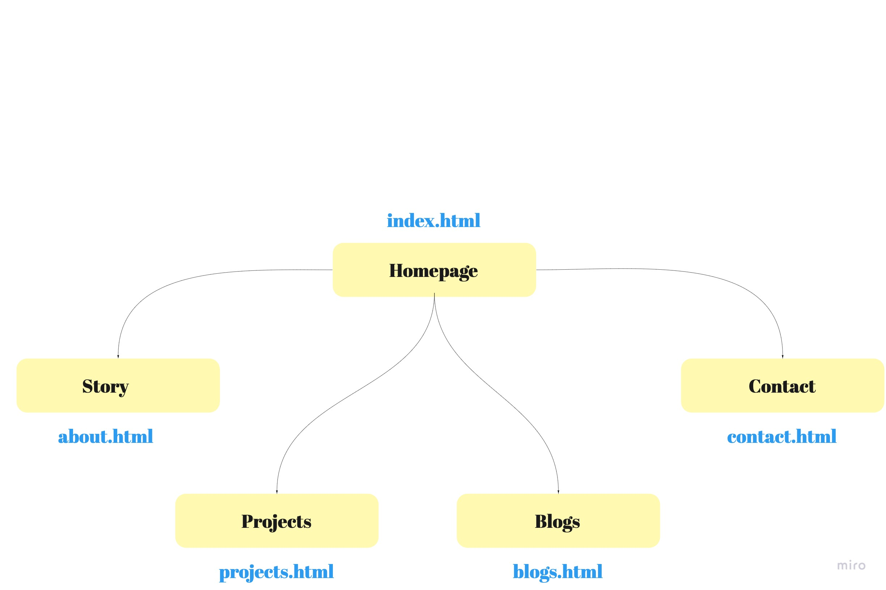

# KUAN LEE - Portfolio Website - T1A3

[Portfolio Website](https://gkuanlee.netlify.com/)

[Github](https://github.com/codebender16/portfolio-project)

# Objective

The main objective to create this portfolio website is to demonstrate my skills in front-end development, design + tech acumens, and to build a personal brand in the tech industry. 

As a developer, it is crucial to continuously engage in the latest methods in building software. The attempt to build this website has allowed me to test my own limitations and brought a new sense of awareness in solving web development challenges. 

# Theme and Aesthetic

The design concept I applied on the portfolio is based off the nature of clouds and its association in our daily life. 

**Clouds** take many forms. How people perceive the shape of the clouds heavily depends on their own imagination. Each person is unique to their ways of solving a common problem.

**Every cloud has a silver lining.** Ideas can be difficult to realise. However, there is always a way to unravel the shining light bulb beyond the clouds.

# Functionality and Features

### Component 1 - Navigation bar and Footer bar

The website has a navigation bar and footer bar built for the purpose of way-finding. The links take visitors to other pages.

The footer bar contains links represented in icons. Each icon is linked to an external website. The ones included are Github and LinkedIn. 

### Component 2 - Background Image

On most pages, there is a background image personally curated through figma. The background image is meant to provide a visual balance on the page it is applied on. 

### Component 3 - Icons

Some icons are downloaded from icon8 and flaticon, and modified on figma. Clouds and cloud in background image are both designed on figma and exported as assets. 

Many icons are used to replace texts. They can help provide better visual balance on the site and reduce the amount of texts used in the content. 

### Component 4 - CV Download

A cloud on the homepage is particularly linked to a CV-download. The goal is to allow potential employers to easily download my CV when they are in a rush.

### Component 5 - Cards

Cards are created as a reusable component for blogs, projects and story pages. 

### Component 6 - Contact and Form

Contact consists of a form (in an expression of a letter). Visitors can get in contact with me through the link to phone number or by filling up the form. The form is linked with "formspree". Every time a user send a message using the form function, the information will be saved on formspree database and an email will be delivered to a nominated inbox. 

### Semantic HTML and Consistent Style

All pages use a consistent style including fonts, colours, backgrounds and icons. 

1. Navigation bar and Footer bar are placed in every page of the site.

2. Font "Montserrat" is imported from Google fonts and used across the whole site. Font size is set as 8px in :root attribute. The font size is then scaled up or down using "em". For pixel-specific parts, "px" is used in place of "em".

3. Colour scheme of the portfolio site is cornflowerblue, cornflower with reduced opacity and white. 

4. White space or negative space are applied between blocks to enhance readability and cleanliness.

5. A linear gradient that represents a time of a day is used to create a virtual sky look. 

### Responsive Design

Due to increasing usage of mobile phones, the website is designed using mobile-first approach. More content are then being added accordingly to the dimension increase.

This allows the right amount of content to be flowing well across modern devices with varied dimensions. 

**NOTE: Iphone X is used as the reference for this website**

CSS Flexbox and CSS Grid are used to achieve this result. CSS Flexbox is applied in devices with width below 600px and CSS Grid is used when the width goes beyond 600px.

By applying these principles, the website becomes more fluid for visitors to interact with.  

### Branches

Three branches of the website have been generated in Github. See below:

- 'master' branch with the base version
- 'purple' branch with a purple font
- 'font-size' branch with the font-size 2em

These versions can be viewed by typing 'git checkout {branch-name}' in the terminal. For example to view the 'dark' branch, type:

`git checkout purple`

The branch versions are not used because they are not compatible with my original design. It was done for experimental purposes.

### Subresource Integrity

Subresource integrity is utilised to ensures that the files delivered to web applications do not contain any unexpected content such as malicious code from Javascript or other languages injected by third parties.

A hash is created using `sha384` and applied in the link tag as the value of the integrity attribute. This protects the stylesheet.css will only load if it is identical to its state when the `sha384` hash was created. 

**NOTE: If any changes have been made, the stylesheet will not be loaded and the HTML page will be displayed with no CSS styling.**

# Sitemap

The sitemap below shows the relationship between homepage and linked pages.

# Tech Stack

- HTML
- CSS
- Trello (workflow manager)
- Miro (sitemap)
- Visual Code (text editor)
- Netlify (web-hosting and deployment site)

# Wireframe and Style Guide

Homepage

Navigation Bar / Hamburger Menu - expanded 

Projects

Blogs

Desktop Homepage

Style Guide

To do
<link integrity="sha384-gc8fYDUd/+UKjcjgxWVQ73kkSjl69/sgKGfXCKu7XlPjjajrNaZ0TfLpvtE86IPn" rel="stylesheet"
    href="./stylesheets/stylesheet.css" />

